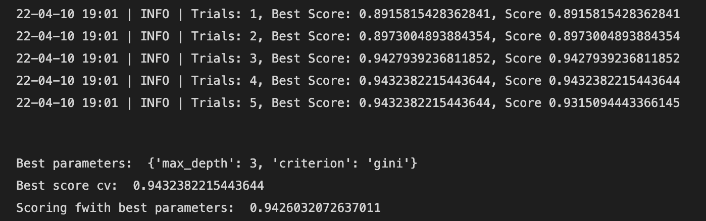

# instrumentum

General utilities for data science projects. 


The goal of this repository is to consolidate functionalities that are tipically not found in other packages, and can facilitate some steps during a data science project. 

The classes created in instrumentum -tipically- inherit from sklearn, which makes them easier to work with, and reuse some code that has been extensively battle-tested. 
Classes use parallelism whenever possible.


1. Feature Generation
2. Model Tuning
3. Feature Selection 
4. Dashboards & Plots
   

## Feature Generation

Class Interactions offers an easy way to create combinatiors of existing features. It is a lightweight class that can be extended with minimum effort.

This simple example showcase how this class can be used with a small DataFrame. The degree indicates how the different columns will be combined (careful, it grows exponentially)

```python
arr = np.array([[5, 2, 3], [5, 2, 3], [1, 2, 3]])
arr = pd.DataFrame(arr, columns=["a", "b", "c"])

interactions = Interactions(operations=["sum", "prod"], degree=(2, 3), verbose=logging.DEBUG)
interactions.fit(arr)


pd.DataFrame(interactions.transform(arr), columns=interactions.get_feature_names_out())
```
Depending on the verbosity, the output can provide a large degree of information

 

## Model Tuning

Class OptunaSearchCV implements a sklearn wrapper for the great Optuna class. It provides a set of distribution parameters that can be easily extended. In this example it makes use of the dispatcher by fetching a decision tree (which is named after the Sklearn class)

```python
search_function = optuna_param_disp[DecisionTreeClassifier.__name__]
cv = RepeatedStratifiedKFold(n_splits=5, n_repeats=2)

os = OptunaSearchCV(
    estimator=DecisionTreeClassifier(),
    scoring="roc_auc",
    cv=cv,
    search_space=search_function,
    n_iter=5,
)
os.fit(X_train, y_train)
```

The output presents all the details depending on the verbosity

 


## Usage

- TODO

## Contributing

Interested in contributing? Check out the contributing guidelines. Please note that this project is released with a Code of Conduct. By contributing to this project, you agree to abide by its terms.

## License

`instrumentum` was created by Federico Montanana. It is licensed under the terms of the MIT license.

## Credits

`instrumentum`  uses:
- Optbining for bining the visuals: https://github.com/guillermo-navas-palencia/optbinning
