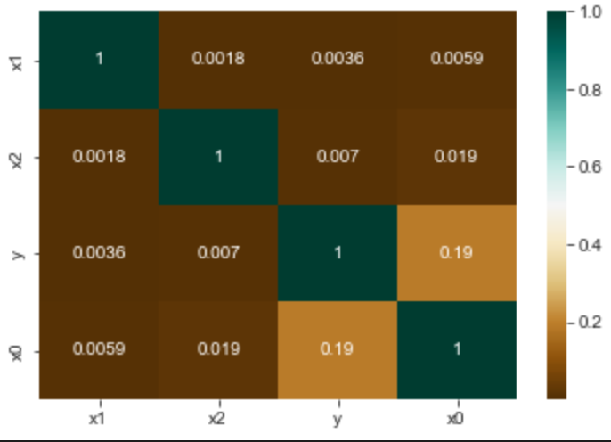
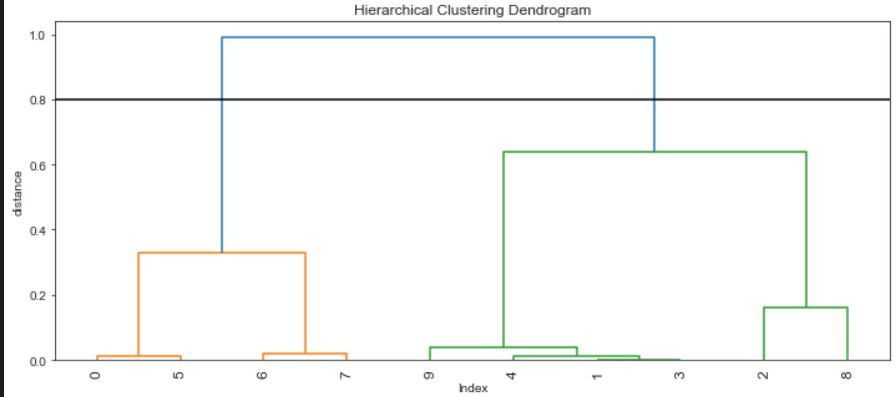
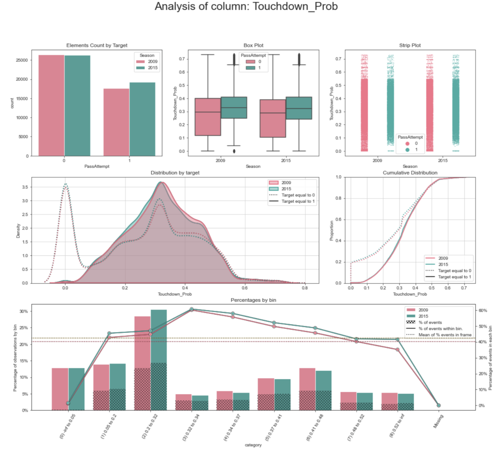
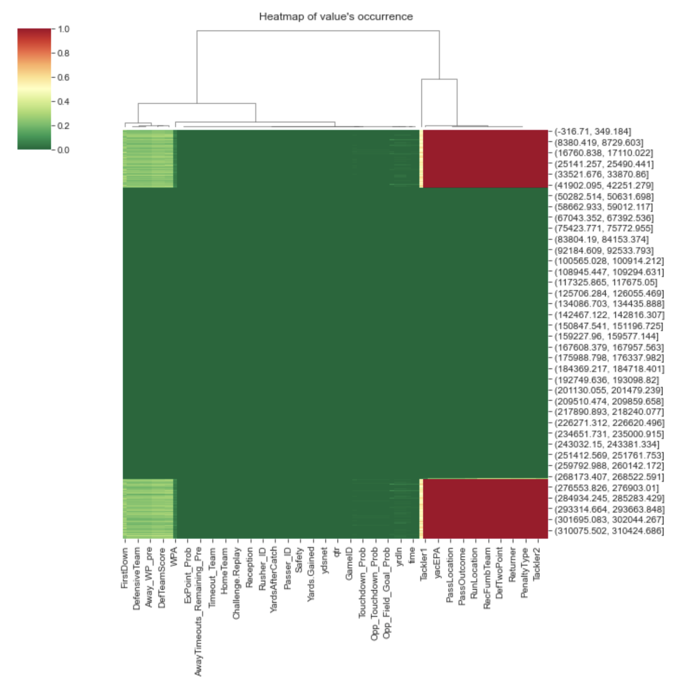
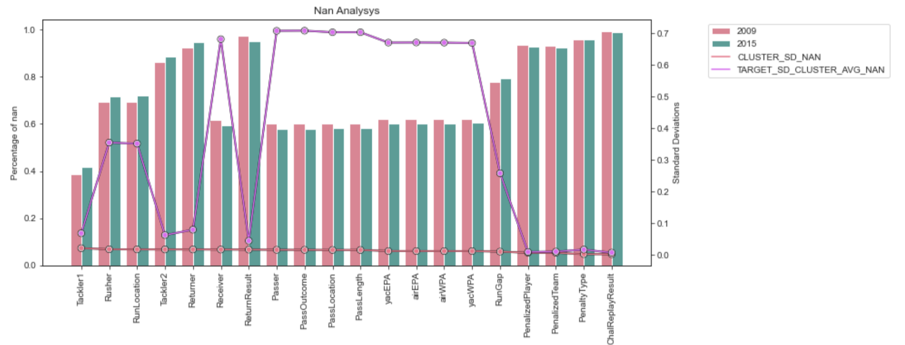

# Instrumentum

**General utilities for data science projects**


The goal of this repository is to provide functionalities that are tipically not found in other packages, and can facilitate some steps during a data science project.


The classes created in `instrumentum` implement sklearn interfaces, which makes it easier to work with them since the general familiarity with sklearn design. Classes use parallelism whenever possible to speed-up the execution time.


## Table of Content <!-- omit in toc -->
  - [Feature Selection](#feature-selection)
    - [Dynamic Stepwise](#dynamic-stepwise)
    - [Clustering](#clustering)
  - [Model Tuning](#model-tuning)
  - [Features Interaction](#features-interaction)
  - [Dashboards & plots](#dashboards-&-plots)
  - [Contributing](#contributing)
  - [License](#license)
  - [Credits](#credits)


# Feature Selection #

## Dynamyc Stepwise


Stepwise is a method used to reduce the dimensionality of datasets, its idea consists of iteratively adding and removing predictors, one by one. One of its limitations is that there might exist variables that interact with each other, or are highly correlated, and the real inference power of those variables will not be realized if evaluations are performed individually.
To illustrate this, the following code artificially creates 2 variables that when combined have a great prediction power, but individually do not. A third variable is created with minimum prediction power.

```python
df = pd.DataFrame(np.random.choice([0, 1], size=(10000, 2)), columns=["x1", "x2"])

# y is created based on x1 and x2, ~70% prediction power, when combined
df["y"] = df.apply(
    lambda x: np.logical_xor(x["x1"], x["x2"]) * 1
    if np.random.ranf() < 0.7
    else np.random.choice([0, 1]),
    axis=1,
)

# another predictor, with ~20% prediction power
df["x0"] = df.apply(
    lambda x: x.y if np.random.ranf() < 0.2 else np.random.choice([0, 1]),
    axis=1,
)

X, y = df[["x0", "x1", "x2"]], df["y"]
```
Plotting the correlation of the matrix, clearly shows that individually, only x0 presents a relationship with y:



If the classic forward stepwise is used in this scenario, and assuming that the stepwise stops when there is no improvement (which doesn't make sense in this small dataset, but it does in gigantic ones), the two interactions will not be discovered.
The class `DynamicStepwise` in this library allows to keep adding/removing predictors iteratively, with an arbitrary number of predictors at each iteration (parameter `combo`). When the number is 1, it is the tipical stepwise, if it is largen than 1 it becomes dyanmic and will try all combinations of predictors up to that number.
If, for example, combo is equal to 3, the library will try all possible combinations between 1, 2 and 3 variables from the set of variables not yet added, and will select the best combination of all those which added to the already selected yield the best result. And will keep adding the next best 3 combinations until the end condition is met (end condition is highly customizable).

Continuing with the previous dataset example, if `DynamicStepwise` is run with just 1 combination at each time (and so becoming the classic stepwise), it will discover only x0:

```python
combs = 1

stepw = DynamicStepwise(
    estimator=os,
    rounding=rounding,
    n_combs=combs,
    verbose=logging.INFO,
    direction="forward",
)
stepw.fit(X, y)
```
The output is:

```
22-05-22 01:19 | INFO | Number of cores to be used: 8, total available: 8

22-05-22 01:19 | INFO | Remaining columns to test: 3
22-05-22 01:19 | INFO | Combinations to test: 3
22-05-22 01:20 | INFO | Best score from combinations: 0.52, global score 0
22-05-22 01:20 | INFO | Best score comes from adding columns: ['x0']
22-05-22 01:20 | INFO | Best columns were added. All columns added so far ['x0']

22-05-22 01:20 | INFO | Remaining columns to test: 2
22-05-22 01:20 | INFO | Combinations to test: 2
22-05-22 01:20 | INFO | Best score from combinations: 0.52, global score 0.52
22-05-22 01:20 | INFO | Best score comes from adding columns: ['x1']
22-05-22 01:20 | INFO | Columns were not added as they do not improve the score. Finishing

22-05-22 01:20 | INFO | Function fit executed in 12.009625673294067 seconds

Forward Best Features:  ['x0']

    Score Columns Added
0   0.52          [x0]
```

The score obtained by using x0 is only 0.52.

If we make a simple change to the parameters, and indicate that the combos to be evaluated (i.e. how many combinations of remaining predictors to evaluate at each step) is 2:

```python
combs = 2
```

The output is:
```
22-05-22 01:49 | INFO | Number of cores to be used: 8, total available: 8

22-05-22 01:49 | INFO | Remaining columns to test: 3
22-05-22 01:49 | INFO | Combinations to test: 6
22-05-22 01:50 | INFO | Best score from combinations: 0.85, global score 0
22-05-22 01:50 | INFO | Best score comes from adding columns: ['x1' 'x2']
22-05-22 01:50 | INFO | Best columns were added. All columns added so far ['x1' 'x2']

22-05-22 01:50 | INFO | Remaining columns to test: 1
22-05-22 01:50 | INFO | Combinations to test: 1
22-05-22 01:50 | INFO | Best score from combinations: 0.87, global score 0.85
22-05-22 01:50 | INFO | Best score comes from adding columns: ['x0']
22-05-22 01:50 | INFO | Best columns were added. All columns added so far ['x0' 'x1' 'x2']

22-05-22 01:50 | INFO | All columns were added. Finishing.

22-05-22 01:50 | INFO | Function fit executed in 13.473716974258423 seconds

Forward Best Features:  ['x0' 'x1' 'x2']

    Score Columns Added
0   0.85      [x1, x2]
1   0.87          [x0]
```

The prediction power increased to 0.87 and both x1 and x2 were selected correctly in the first iteration, as they both are the two combinations that yield the best result.

Indeed, the larger the combo parameter, the best selection of features, and the exponential increase in time it will take to complete. There is a tradeoff between prediction power and performance, tipically a value of 2 or 3 for the combo would be enough. The combo can be defined as large as the total number of predictors, which will cause the algorithm to guarantee to find the best predictors, but it will do so by evaluating absolutely all possible combinations, which becomes infeasible with any dataset with more than a handful of predictors.


## Clustering Selection

One of the promises of a good set of predictors, is that they have to be highly correlated to the target, without having correlation among themselves.
The class `ClusterSelection` tries to obtain that ideal scenario, which is desirable in datasets with high dimensionality, by clustering all predictors based on their similarity ("similarity" can be parameterized as a correlation matrix, with Pearson as the default). Once the clusters are identified the class allows to select the best predictors within each. The selection of best predictors (be it one by cluster or n) can be performed using `DynamicStepwise`.

`DynamicStepwise` can be passed to `ClusterSelection` with a pre configuration of the max n columns, and by doing so it will get the best n combination of variables within each cluster. Combining `DynamicStepwise` with `ClusetrSelection` produces a sophisticated pipeline that is heuristic in nature yet it yields results close the the global optimal solution.

One of the key parameters of this class is how to find the clusters once the correlation matrix is created. There are many techniques to form flat clusters, `ClusterSelection` uses [fcluster](https://docs.scipy.org/doc/scipy/reference/generated/scipy.cluster.hierarchy.fcluster.html) method behind the scene, where pameter *t* is passed over to this function from the class.
Roughly, the parameter t can define a threshold or a fixed number of clusters. If using a threshold, a dendogram analysis can help visualize the best possible "cut" line. See the docs for details. In this plot the dendogram presents the clusters created, and the two selected due to the threshold defined at 0.8




# Model Tuning

Class `OptunaSearchCV` implements a sklearn wrapper for the great Optuna class. It provides a set of distribution parameters that can be easily extended. In this example it makes use of the dispatcher by fetching a decision tree (which is named after the Sklearn class)

```python
search_function = optuna_param_disp[DecisionTreeClassifier.__name__]
cv = RepeatedStratifiedKFold(n_splits=5, n_repeats=2)

os = OptunaSearchCV(
    estimator=DecisionTreeClassifier(),
    scoring="roc_auc",
    cv=cv,
    search_space=search_function,
    n_iter=5,
)
os.fit(X_train, y_train)
```

The output presents all the details depending on the verbosity

```
22-05-22 11:34 | INFO | Trials: 1, Best Score: 0.8791199817742967, Score 0.8791199817742967
22-05-22 11:34 | INFO | Trials: 2, Best Score: 0.8797784704316944, Score 0.8797784704316944
22-05-22 11:34 | INFO | Trials: 3, Best Score: 0.9500029865511614, Score 0.9500029865511614
22-05-22 11:34 | INFO | Trials: 4, Best Score: 0.9505017406869891, Score 0.9505017406869891
22-05-22 11:34 | INFO | Trials: 5, Best Score: 0.9505017406869891, Score 0.931279172306293

Best parameters:  {'max_depth': 3, 'criterion': 'entropy'}
Best score cv:  0.9505017406869891
Scoring with best parameters:  0.9495986837807825
```

# Features Interaction

Class `Interactions` offers an easy way to create combinatiors of existing features. It is a lightweight class that can be extended with minimum effort.

This simple example showcase how this class can be used with a small DataFrame. The degree indicates how the different columns will be combined (careful, it grows exponentially)

```python
arr = np.array([[5, 2, 3], [5, 2, 3], [1, 2, 3]])
arr = pd.DataFrame(arr, columns=["a", "b", "c"])

interactions = Interactions(operations=["sum", "prod"], degree=(2, 3), verbose=logging.DEBUG)
interactions.fit(arr)


pd.DataFrame(interactions.transform(arr), columns=interactions.get_feature_names_out())
```
Depending on the verbosity, the output can provide a large degree of information

```
22-05-16 23:11 | INFO | Total number of interactions calculated: 8
22-05-16 23:11 | INFO | Function fit executed in 0.004034996032714844 seconds
22-05-16 23:11 | DEBUG | New feature created: a_sum_b
22-05-16 23:11 | DEBUG | New feature created: a_prod_b
22-05-16 23:11 | DEBUG | New feature created: a_sum_c
22-05-16 23:11 | DEBUG | New feature created: a_prod_c
22-05-16 23:11 | DEBUG | New feature created: b_sum_c
22-05-16 23:11 | DEBUG | New feature created: b_prod_c
22-05-16 23:11 | DEBUG | New feature created: a_sum_b_sum_c
22-05-16 23:11 | DEBUG | New feature created: a_prod_b_prod_c

```
| a   | b   | c   | a_sum_b | a_prod_b | a_sum_c | a_prod_c | b_sum_c | b_prod_c | a_sum_b_sum_c | a_prod_b_prod_c |
| --- | --- | --- | ------- | -------- | ------- | -------- | ------- | -------- | ------------- | --------------- |
| 5   | 2   | 3   | 7       | 10       | 8       | 15       | 5       | 6        | 10            | 30              |
| 5   | 2   | 3   | 7       | 10       | 8       | 15       | 5       | 6        | 10            | 30              |
| 1   | 2   | 3   | 3       | 2        | 4       | 3        | 5       | 6        | 6             | 6               |

# Dashboards & Plots #

`instrumentum` library includes several visuals that can facilitate the quick analysis of predictors. Visuals are created as standalone plots, as well as dashboards that include several plots. There is also a class `DistAnalyzer` which intends to automate the creation of dashboards, by automatically identifying the type of variable (categorical, continuos), the type of target (binary, categorical, continuos) and draw the most appropiate dashboard.

All the plots, dashboards and classes created in instrumentum tipically include the following parameters:
- x: the predictor to be plotted
- y: the targe. If included, it might try to plot visuals including the x and y together
- cluster: this parameter groups rows that are logically connected. For example, if we have a distribution generated at time a, and another at time a', that value can be used to separate those entries and have visual comparison on them (think of "hue" in seaborn)
- target_true: for those cases that y is binary, it indicates what is the true value (defaul is 1)

Read the extensive examples in the [docs](https://github.com/FedericoMontana/instrumentum/blob/master/docs/examples_plots.ipynb)

Advanced dashboards can be generated with a single line of code, which visualize the different perspectives of a predictor:



Full datasets can be analyzied to identy particular patterns, for example the existence of null ("nans") values:




Visuals are constantly being enhanced. See the docs for details.

## Contributing

Interested in contributing? Check out the contributing guidelines. Please note that this project is released with a Code of Conduct. By contributing to this project, you agree to abide by its terms.

## License

`instrumentum` was created by Federico Montanana. It is licensed under the terms of the MIT license.

## Credits

`instrumentum`  uses:
- Optbining for bining the visuals: https://github.com/guillermo-navas-palencia/optbinning
